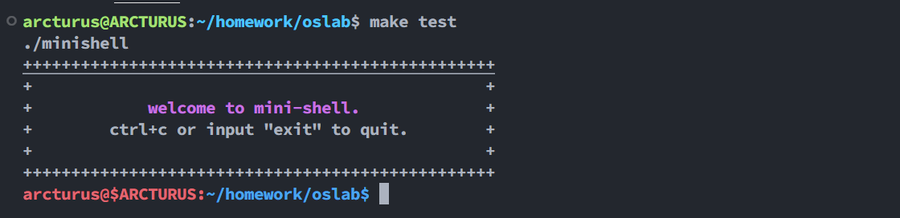

# MiniShell 的设计与实现

## 实验目标

- [ ] 支持后台符号 `&`
- [x] 支持串行执行多个命令 `;`
- [ ] 支持管道 `|`
- [ ] 支持环境变量 `export` `env`
- [ ] 支持字符串的输出 `echo`, 重定向 `>>` `>`
- [ ] 支持变量 `$`
- [ ] 支持历史 `history`
- [x] 支持 `alias` (不能自定义)

## 编译

```bash
make build
```

## 测试

```bash
make test
```

回车后可以看到 shell 界面



## 设计